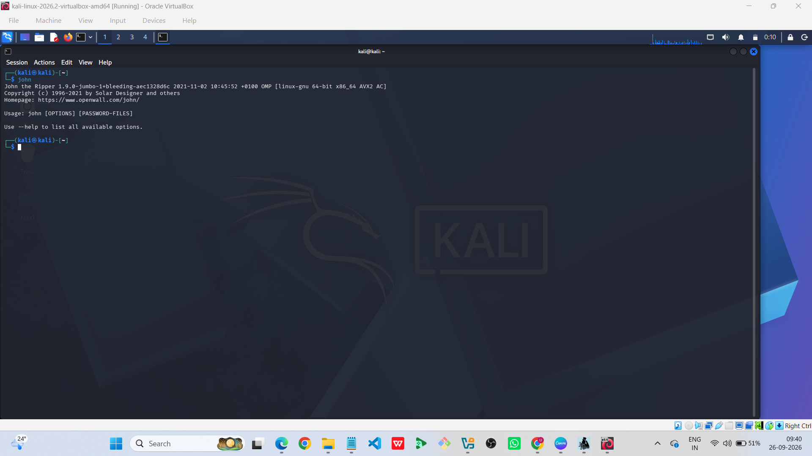
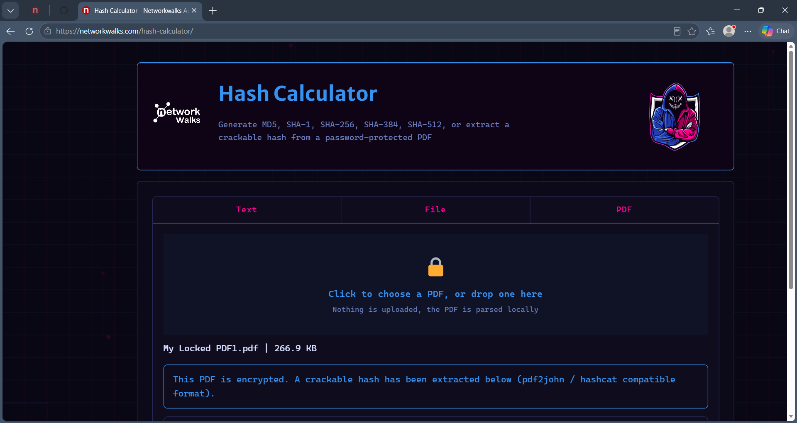
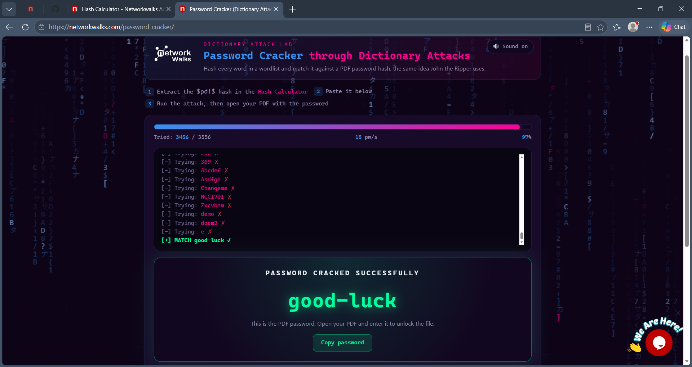

# 🔐 Networkwalks Week 03 | PDF Password Cracking & Security Assessment

### JTR • John the Ripper • Hash Extraction • Networkwalks Password Cracker

**Author:** Ishanya Jha
**Program:** Cybersecurity Internship
**Batch:** B083-Networkwalks
**Week:** 03
**Duration:** September 2026

---

## 📌 Project Overview

This repository contains my **Week 3 practical work** completed as part of the Networkwalks Cybersecurity Internship.

The objective of this week was to understand the practical process of **PDF password security testing**, including:

* PDF hash extraction
* Password cracking using JTR/Johnny
* Password cracking using John the Ripper on Kali Linux
* Hash extraction using Networkwalks Hash Calculator
* Password recovery using Networkwalks Password Cracker
* Verification of recovered passwords by opening the assigned PDF files

Three assigned password-protected PDF files were used throughout the practical exercises.

All activities were performed within the **authorized educational laboratory environment**.

---

# 🎯 Objectives

The main objectives of this practical were:

1. Understand how password-protected PDF files store password-related information.
2. Extract password hashes from protected PDF files.
3. Use **JTR/Johnny** for password-cracking practice.
4. Use **John the Ripper on Kali Linux**.
5. Use the **Networkwalks Hash Calculator** to generate PDF hashes.
6. Use the **Networkwalks Password Cracker** to recover the passwords.
7. Verify the recovered passwords by opening the assigned PDFs.
8. Document the complete practical work with screenshots.

---

# 🧰 Tools & Technologies Used

| Tool / Technology             | Purpose                            |
| ----------------------------- | ---------------------------------- |
| JTR / Johnny                  | Password-cracking interface        |
| John the Ripper               | Password cracking on Kali Linux    |
| Kali Linux                    | Security testing environment       |
| `pdf2john.pl`                 | PDF hash extraction                |
| Networkwalks Hash Calculator  | PDF hash generation                |
| Networkwalks Password Cracker | Password recovery                  |
| PDF Reader                    | Password verification              |
| GitHub                        | Project documentation and evidence |

---

# 📂 Practical Workflow

The overall workflow followed during the practical was:

```text
Password-Protected PDF
        │
        ▼
   Hash Extraction
        │
        ├───────────────┐
        ▼               ▼
   JTR / Johnny     Kali John
        │               │
        └───────┬───────┘
                ▼
        Password Recovery
                │
                ▼
    Networkwalks Hash Calculator
                │
                ▼
    Networkwalks Password Cracker
                │
                ▼
        Recovered Password
                │
                ▼
        PDF Verification
```

---

# 🔐 W3-PM1 | JTR / John the Ripper

## 1. JTR / Johnny Interface

The first workflow involved using the **JTR/Johnny graphical interface** for password-cracking activities.

The assigned PDF hash was loaded into the interface and the cracking process was performed in the authorized laboratory environment.

### Input

* Assigned password-protected PDF
* Extracted PDF hash

### Process

1. Open the JTR/Johnny interface.
2. Load the extracted PDF hash.
3. Start the password-cracking process.
4. Monitor the cracking process.
5. Record the successful result.

### Evidence


**Screenshot:** JTR/Johnny interface showing the password-cracking workflow.

---

# 🐉 2. John the Ripper on Kali Linux

The second workflow was performed using the **built-in John the Ripper installation on Kali Linux**.

John the Ripper was first verified on the system and then used to process the extracted PDF hashes.

### Tool Verification

The installation was checked using:

```bash
which john
```

The system returned the John the Ripper executable path.

### PDF Hash Extraction

The PDF hash was extracted using:

```bash
pdf2john.pl "My Locked PDF1.pdf" > pdf1.hash
```

The resulting hash file was then supplied to John the Ripper.

### Password Cracking

The cracking process was started using:

```bash
john pdf1.hash
```

After the cracking process completed, the result was verified using:

```bash
john --show pdf1.hash
```

The same process was performed for the assigned PDF files.

### Input

```text
Password-protected PDF
        ↓
PDF hash
        ↓
John the Ripper
```

### Output

```text
Password hash successfully processed
        ↓
Password recovered
        ↓
PDF password verified
```

### Evidence



**Screenshot:** Kali Linux terminal showing the John the Ripper password-cracking workflow.

---

# 🌐 W3-PM2 | Networkwalks Password Security Tools

The second practical workflow used the **Networkwalks online Hash Calculator and Password Cracker**.

The purpose was to understand how a PDF hash can be extracted and then used for password-recovery testing.

---

# 🔎 3. Networkwalks Hash Calculator

The Networkwalks Hash Calculator was used to generate the password hash from the assigned PDF files.

### Workflow

1. Open the Networkwalks Hash Calculator.
2. Upload the assigned password-protected PDF.
3. Allow the tool to process the file.
4. Obtain the generated PDF hash.
5. Use the generated hash for the password-cracking stage.

### Input

```text
Password-Protected PDF
```

### Output

```text
PDF Password Hash
```

The generated hash was then used as the input for the Networkwalks Password Cracker.

### Evidence



**Screenshot:** Networkwalks Hash Calculator showing the PDF hash extraction process.

---

# 🔓 4. Networkwalks Password Cracker

The extracted PDF hash was then submitted to the **Networkwalks Password Cracker**.

### Workflow

1. Copy the generated PDF hash.
2. Open the Networkwalks Password Cracker.
3. Paste the hash into the required field.
4. Start the cracking process.
5. Wait for the password-cracking process to complete.
6. Record the successful recovery result.

### Input

```text
PDF Hash
```

### Processing

```text
PDF Hash
    ↓
Password Cracker
    ↓
Password Recovery
```

### Output

```text
Recovered PDF Password
```

The recovered password was subsequently used to verify the assigned PDF files.

### Evidence



**Screenshot:** Networkwalks Password Cracker showing the successful password recovery result.

---

# 📄 PDF Password Verification

After the passwords were recovered, each assigned PDF was opened to verify that the recovered credentials were correct.

---

## 📄 PDF 1 Verification

The first assigned PDF was successfully opened using the recovered password.


**Evidence:** PDF 1 successfully opened after password recovery.

---

## 📄 PDF 2 Verification

The second assigned PDF was successfully opened using its recovered password.


**Evidence:** PDF 2 successfully opened after password recovery.

---

## 📄 PDF 3 Verification

The third assigned PDF was successfully opened using its recovered password.


**Evidence:** PDF 3 successfully opened after password recovery.

---

# 📊 Final Results

| PDF   | JTR / Johnny | Kali John   | Networkwalks Tools | PDF Verification |
| ----- | ------------ | ----------- | ------------------ | ---------------- |
| PDF 1 | ✅ Completed  | ✅ Completed | ✅ Completed        | ✅ Successful     |
| PDF 2 | ✅ Completed  | ✅ Completed | ✅ Completed        | ✅ Successful     |
| PDF 3 | ✅ Completed  | ✅ Completed | ✅ Completed        | ✅ Successful     |

All three assigned PDF files were successfully processed and verified using the different password-security workflows.

---

# 🔄 Input → Process → Output

## Workflow 1: JTR / Johnny

**Input:**

```text
PDF Hash
```

**Process:**

```text
JTR / Johnny
```

**Output:**

```text
Recovered Password
```

---

## Workflow 2: Kali Linux

**Input:**

```text
PDF Hash File
```

**Process:**

```text
John the Ripper
```

**Output:**

```text
Recovered Password
```

---

## Workflow 3: Networkwalks Tools

**Input:**

```text
Password-Protected PDF
```

**Process:**

```text
Networkwalks Hash Calculator
        ↓
PDF Hash
        ↓
Networkwalks Password Cracker
```

**Output:**

```text
Recovered Password
```

---

# 🧠 Key Learning Outcomes

Through this practical, I gained hands-on experience with:

* PDF password security
* Password hash extraction
* John the Ripper
* JTR/Johnny
* Kali Linux security tools
* `pdf2john.pl`
* Hash-based password cracking
* Networkwalks Hash Calculator
* Networkwalks Password Cracker
* Password verification
* Security documentation
* Evidence collection and technical reporting

---

# 🔐 Security & Ethical Considerations

All password-cracking activities documented in this repository were performed on **assigned files within an authorized educational internship environment**.

The techniques demonstrated here should only be used on:

* Files you own
* Systems you are authorized to test
* Educational laboratory environments
* Security assessments with explicit permission

Actual recovered passwords and unnecessary sensitive hash information should not be published publicly.

---

# 📸 Evidence Included

This repository contains the following practical evidence:

```text
01-jtr-interface.png
02-kali-john.png
03-networkwalks-hash-calculator.png
04-networkwalks-password-cracker.png
05-pdf1-unlocked.png
06-pdf2-unlocked.png
07-pdf3-unlocked.png
```

These screenshots document the major stages of the practical from password-cracking setup through final PDF verification.

---

# 📁 Repository Structure

```text
NETWORKWALKS-ISHANYA-JHA-B083-WK3-PM1-PM2-JTR-PDF-PASSWORD-CRACKING/
│
├── README.md
│
├── 01-jtr-interface.png
├── 02-kali-john.png
├── 03-networkwalks-hash-calculator.png
├── 04-networkwalks-password-cracker.png
├── 05-pdf1-unlocked.png
├── 06-pdf2-unlocked.png
└── 07-pdf3-unlocked.png
```

---

# ✅ Conclusion

Week 3 provided practical experience with **PDF password security, hash extraction, password cracking, and password verification**.

The practical demonstrated the use of multiple approaches:

* **JTR / Johnny**
* **John the Ripper on Kali Linux**
* **Networkwalks Hash Calculator**
* **Networkwalks Password Cracker**

The three assigned PDF files were successfully processed and verified, providing hands-on experience with password-security concepts and practical cybersecurity tools.

---

## 👤 Author

**Ishanya Jha**
MCA 3rd Semester
Cybersecurity & Web Development Intern
**Networkwalks | B083**

---

### 🔐 Networkwalks Cybersecurity Internship | Week 03
